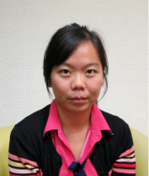

[Justyna Petke](http://www0.cs.ucl.ac.uk/staff/j.petke) is a Principal Research Fellow and Proleptic Senior Lecturer in the Centre for Research on Evolution, Search and Testing (CREST), at University College London. She is interested in Constraint Satisfaction, Search-Based Software Engineering, and Genetic Improvement.

 
 
 

[Shin Hwei Tan](https://www.shinhwei.com) is a tenure-track Assistant Professor at the Southern University of Science and Technology. Her research interests include automated program repair, software testing, comment analysis, test repair, and mobile app analysis.

 
 
 

[William B. Langdon](http://www0.cs.ucl.ac.uk/staff/w.langdon) is a Professorial research associate at University College London. His research interests include genetic programming and genetic improvement.

 
 
 
 

[Westley Weimer](https://web.eecs.umich.edu/~weimerw) is a Professor at the University of Michigan. He is interested in program analysis and transformation, automated program repair, and improvement of software properties.

 
 

## Web Chair

[Bobby R. Bruce](https://web.cs.ucla.edu/~b.bruce) is a Postdoctoral Scholar at the University of California, Los Angeles. His research interests include genetic improvement, and search-based software engineering. 
