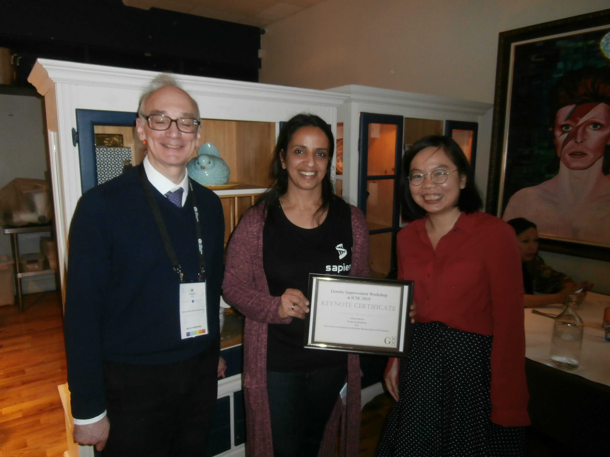

[Awards](#awards)
[Keynote](#keynote)
[Papers](#papers)
[Organisers](#organisers)
[PC](#pc)
[Sponsors](#sponsors) 
[Photos](#photos)

## **The 6th International Workshop on Genetic Improvement @[ICSE 2019](http://2019.icse-conferences.org)**

{: style="text-align:center"}

The 6th Workshop on Genetic Improvement was held at the International Conference on Software Engineering ([ICSE](https://conf.researchr.org/home/icse-2019)), 2019, Montreal, Canada, on **Tuesday, 28th of May 2019**. 

## Awards

We wish to congratulate <a href="https://be.linkedin.com/in/jhe-yu-liou-1122759b">Jhe-Yu Liou</a>, <a href="https://forrest.biodesign.asu.edu">Stephanie Forrest</a>, and <a href="http://faculty.engineering.asu.edu/carolewu">Carole-Jean Wu</a> for winning this workshop's **Best Paper Award** with <strong><a href="./paper_pdfs/liou2019genetic.pdf">Genetic Improvement of GPU Code</a></strong>.

This workshop's **Best Presentation Award** went to <a href="http://kjleach.eecs.umich.edu">Kevin Leach</a>, <a href="https://isearch.asu.edu/profile/1639008">Ryan Dougherty</a>, <a href="http://cspensky.info">Chad Spensky</a>, <a href="https://forrest.biodesign.asu.edu">Stephanie Forrest</a>, and <a href="http://web.eecs.umich.edu/~weimerw">Westley Weimer</a> for their presentation of <strong><a href="paper_pdfs/leach2019evolutionary.pdf">Evolutionary Computation from Improving Malware Analysis</a></strong> (presentation slides are available <a href="slides/leach2019evolutionary_slides.pdf">here</a>).

## Keynote

The workshop's keynote presentation entitled **Industrial experience of Genetic Improvement in Facebook** was given by Nadia Alshahwan. 

Nadia Alshahwan is a Software Engineer in testing and verification at Facebook. She is part of the Sapienz automated testing team, who are the first to apply SBSE-based Android testing and automated bug fixing at a large industrial scale. Her main interests are automated test generation and automated oracles. Nadia received a PhD from UCL in web application testing. She has also worked as a researcher in security and model based testing. Before joining Facebook, she was an information architect at JP&nbsp;Morgan.

## Papers

<strong><a href="paper_pdfs/blot2019gi.pdf">Fuzzy Edit Sequences in Genetic Improvement</a></strong>
by <a href="http://www0.cs.ucl.ac.uk/staff/a.blot">Aymeric Blot</a>         

Genetic improvement uses automated search to find improved versions of existing software. Edit sequences have been proposed as a very convenient way to represent code modifications, focusing on the changes themselves rather than duplicating the entire program. However, edits are usually defined in terms of practical operations rather than in terms of semantic changes; indeed, crossover and other edit sequence mutations usually never guarantee semantic preservation. We propose several changes to usual edit sequences, specifically augmenting edits with content data and using fuzzy matching, in an attempt to improve semantic preservation.

 

<strong><a href="paper_pdfs/krauss2019mining.pdf">Mining Patterns from Genetic Improvement Experiments</a></strong>            
by <a href="https://research.fh-ooe.at/en/staff/25755">Oliver Krauss</a>, <a href="http://www.ssw.uni-linz.ac.at/General/Staff/HM/">Hanspeter Mössenböck</a>, <a href="http://fh-ooe.academia.edu/MichaelAffenzeller">Michael Affenzeller</a>
<a href="slides/krauss2019mining_slides.pdf">[SLIDES]</a>

When conducting genetic improvement experiments, a large amount of individuals (~ population size * generations) is created and evaluated. The corresponding experiments contain valuable data concerning the fitness of individuals for the defined criteria, such as run-time performance, memory use or robustness. This publication presents an approach to utilize this information in order to identify recurring context independent patterns in abstract syntax trees (ASTs). These patterns can be applied for restricting the search space (in the form of anti-patterns) or for grafting operators in the population. Future work includes an evaluation of this approach, as well as extending it with wildcards and class hierarchies for larger and more generalized patterns.

 

<strong><a href="paper_pdfs/leach2019evolutionary.pdf">Evolutionary Computation from Improving Malware Analysis</a></strong>            
by <a href="http://kjleach.eecs.umich.edu">Kevin Leach</a>, <a href="https://isearch.asu.edu/profile/1639008">Ryan Dougherty</a>, <a href="http://cspensky.info">Chad Spensky</a>, <a href="https://forrest.biodesign.asu.edu">Stephanie Forrest</a>, <a href="http://web.eecs.umich.edu/~weimerw">Westley Weimer</a>                                             
<a href="slides/leach2019evolutionary_slides.pdf">[SLIDES]</a> 

Research in genetic improvement (GI) conventionally focuses on the improvement of software, including the automated repair of bugs and vulnerabilities as well as the refinement of software to increase performance. Eliminating or reducing vulnerabilities using GI has improved the security of benign software, but the growing volume and complexity of malicious software necessitates better analysis techniques that may benefit from a GI-based approach. Rather than focus on the use of GI to improve individual software artifacts, we believe GI can be applied to the tools used to analyze malicious code for its behavior. First, malware analysis is critical to understanding the damage caused by an attacker, which GI-based bug repair does not currently address. Second, modern malware samples leverage complex vectors for infection that cannot currently be addressed by GI.  In this paper, we discuss an application of genetic improvement to the realm of automated malware analysis through the use of variable-strength covering arrays.

 

<strong><a href="./paper_pdfs/xin2019better.pdf">Better Code Search and Reuse for Better Program Repair</a></strong>            
by <a href="https://www.scs.gatech.edu/people/qi-xin">Qi Xin</a>, <a href="https://cs.brown.edu/~spr">Steven Reiss</a>
<a href="slides/xin2019better_slides.pdf">[SLIDES]</a> 

A branch of automated program repair (APR) techniques look at finding and reusing existing code for bug repair. ssFix is one of such techniques that is syntactic search-based: it searches a code database for code fragments that are syntactically similar to the bug context and reuses such code fragments to produce patches. The keys to its success lie in the approaches it uses for code search and code reuse. We investigated the effectiveness of ssFix using the Defects4J bug dataset and found that its code search and code reuse approaches are not truly effective and can be significantly improved. Motivated by the investigation, we developed a new repair technique sharpFix that follows ssFix's basic idea but differs significantly in the approaches used for code search and code reuse. We compared sharpFix and ssFix on the Defects4J dataset and confirmed through experiments that (1) sharpFix's code search and code reuse approaches are better than ssFix's approaches and (2) sharpFix can do better repair. sharpFix successfully repaired a total of 36 Defects4J bugs and outperformed many existing repair techniques in repairing more bugs. We also compared sharpFix, ssFix, and four other techniques on another dataset Bugs.jar-ELIXIR. Our results show that sharpFix did better than others and repaired the largest number of bugs.

 

<strong><a href="./paper_pdfs/ding2019leveraging.pdf">Leveraging Program Invariants to Promote Population Diversity in Search-Based Automatic Program Repair</a></strong>            
by <a href="https://www.linkedin.com/in/zhen-yu-ding-23a389155">Zhen Yu Ding</a>, <a href="https://www.linkedin.com/in/yiwei-lyu-209176151">Yiwei Lyu</a>, <a href="https://www.isri.cmu.edu/people/core-faculty/timperley-christopher.html">Christopher Timperley</a>, <a href="https://clairelegoues.com">Claire Le Goues</a>                                             
<a href="slides/ding2019leveraging_slides.pdf">[SLIDES]</a> 

Search-based automatic program repair has shown promise in reducing the cost of defects in real-world software.However, to date, such techniques have typically been most successful when constructing short or single-edit repairs. This is true even when techniques make use of heuristic searchstrategies, like genetic programming, that in principle support the construction of patches of arbitrary length. One key reason is that the fitness function traditionally depends entirely  on testcases, which are poor at identifying partially correct solutions and leadto a fitness landscape with many plateaus. We propose a novel fitness function that optimizes for both functionality and semantic diversity, characterized using learned invariant sover intermediate behavior. Our early results show that this newapproach improves semantic diversity and fitness granularity, but does not statistically significantly improve repair performance.

<strong><a href="./paper_pdfs/liou2019genetic.pdf">Genetic Improvement of GPU Code</a></strong>
by <a href="https://be.linkedin.com/in/jhe-yu-liou-1122759b">Jhe-Yu Liou</a>, <a href="https://forrest.biodesign.asu.edu">Stephanie Forrest</a>, <a href="http://faculty.engineering.asu.edu/carolewu">Carole-Jean Wu</a>
<a href="slides/liou2019genetic_slides.pdf">[SLIDES]</a>

As the programming stack and tool support for GPU have matured, GPUs have become accessible to programmers who often lack domain-specific knowledge of the underlying architecture and fail to fully leverage the GPU’s computation power. This paper presents GEVO (Gpu EVOlution), a tool for automatically tuning the performance of GPU kernels in the LLVM representation to meet desired criteria. GEVO uses population-based search to find edits to programs compiled to LLVM-IR that improve performance on desired criteria and retain required functionality. GEVO extends earlier GI work by operating directly on the LLVM-IR without custom representations or other manual interventions. We demonstrate that GEVO improves runtime on NVIDIA Tesla P100 for many programs in the Rodinia benchmark suite and a supervised machine learning code, ThunderSVM. For the Rodinia benchmark, GEVO improves GPU kernel runtime performance by an average of 13.87% and as much as 43% over the fully compiler-optimized baseline. If the kernel output accuracy is relaxed to tolerate 1% error, GEVO can find kernel variants that outperform the baseline version by an average of 15.47%. For ThunderSVM, GEVO reduces entire model training time by 50% and 24.8%, for MNIST handwriting recognition dataset and a9a income prediction, where the accuracy of trained model are improved by 0.17% and 0.04% respectively.
 
                                                                        

## Organisers

[Justyna Petke](http://www0.cs.ucl.ac.uk/staff/j.petke) is a Principal Research Fellow and Proleptic Senior Lecturer in the Centre for Research on Evolution, Search and Testing (CREST), at University College London. She is interested in Constraint Satisfaction, Search-Based Software Engineering, and Genetic Improvement.

 
 
 

[Shin Hwei Tan](https://www.shinhwei.com) is a tenure-track Assistant Professor at the Southern University of Science and Technology. Her research interests include automated program repair, software testing, comment analysis, test repair, and mobile app analysis.

 
 
 

[William B. Langdon](http://www0.cs.ucl.ac.uk/staff/w.langdon) is a Professorial research associate at University College London. His research interests include genetic programming and genetic improvement.

 
 
 
 

[Westley Weimer](https://web.eecs.umich.edu/~weimerw) is a Professor at the University of Michigan. He is interested in program analysis and transformation, automated program repair, and improvement of software properties.

 
 

 

Web Chair: [Bobby R. Bruce](https://web.cs.ucla.edu/~b.bruce) is a Postdoctoral Scholar at the University of California, Los Angeles. His research interests include genetic improvement, and search-based software engineering. 

## PC

[Brad Alexander](http://www.cs.adelaide.edu.au/~brad/) is a Lecturer at the University of Adelaide.

[Nadia Alshahwan](https://www.linkedin.com/in/nadiaalshahwan) is a Software Engineer at Facebook, London.

[Aniko Ekart](https://www2.aston.ac.uk/eas/staff/a-z/dr-aniko-ekart) is the Associate Dean of Postgraduate Programmes at Aston University.

[Saemundur Haraldson](https://www.lancaster.ac.uk/sci-tech/about-us/people/saemundur-haraldsson) is a Senior Research Associate at Lancaster University.

[Ciera Jaspan](https://research.google.com/pubs/CieraJaspan.html) is the tech lead manager of the Engineering Productivity Research within Developer Infrastructure at Google.

[Colin Johnson](http://www.cs.kent.ac.uk/people/staff/cgj) is a Reader and Associate Dean of Sciences at the University of Kent.

[Lea Kristin Gerling](https://sse.uni-hildesheim.de/mitglieder/lea-kristin-gerling) works for the Software Engineering Systems group at Hildesheim University.

[Corina Pasareanu](https://ti.arc.nasa.gov/profile/pcorina/) is a software engineering researcher at the NASA Ames Research Center.

[Abhik Roychoudhury](http://www.comp.nus.edu.sg/~abhik/) is a Professor in the School of Computing at the National University of Singapore.

[Christopher Timperley](https://www.cs.cmu.edu/directory/ctimperl) is a Systems Scientist at Carnegie Mellon University.

[Emamurho Ugherughe](https://www.linkedin.com/in/emamurho) is a Software Engineer at SAP, Berlin.

[Markus Wagner](http://cs.adelaide.edu.au/~markus/) is a Senior Lecturer at the University of Adelaide.

[David R. White](http://www.davidrwhite.co.uk/) is a Research Associate at the University of Sheffield.

[John Woodward](http://www.eecs.qmul.ac.uk/people/view/54720/dr-john-woodward) is a Lecturer at Queen Mary University.

[Jifeng Xuan](http://jifeng-xuan.com/) is a Professor at Wuhan University.

[Bing Xue](http://ecs.victoria.ac.nz/Main/BingXue) is a Senior Lecturer at the University of Wellington.

[Ling Zhu](https://linkedin.com/in/ling-zhu-a8098b15) is a Research Engineer at the Ford Motor Company.

[Nur Zincir-Heywood](http://www.cs.dal.ca/~zincir) is a Professor at Dalhousie University.

## Sponsors

We are grateful to our sponsors for their support of the 6th International Workshop (GI@ICSE 2019).

## Photos

  
  
  
  
  
  
  
  
  
  
  
  
  
  
   
