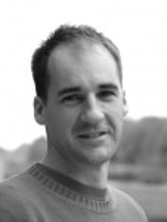

[Papers](#papers)

[CFP](#call-for-papers)

[Organisers](#organisers)

## **Tutorial on Genetic improvement: Taking real-world source code and improving it using genetic programming @[ASE 2020](https://conf.researchr.org/home/ase-2020)**

This Tutorial will be held at the  Special Session on Genetic Improvement will be held at the 35th IEEE/ACM International Conference on Automated Software Engineering (ASE), 2020 [ASE](https://conf.researchr.org/home/ase-2020), 2020, on **21-25 September 2020**. The conference will be fully virtual. Details can be found [here](https://conf.researchr.org/home/ase-2020).

## Overview

Within the large field of Search-Based Software Engineering (SBSE), the relatively young area of [Genetic Improvement of Software](./faq.html) (GI) aims to improve the properties of software at the level of source-code. This means that it operates directly on Java or C, and it typically starts with starts with real-world software. This makes GI attractive for industrial applications, e.g. in contrast to Genetic Programming that aims to evolve applications from scratch. In this tutorial, we demonstrate how we can optimise with GI the physical properties of code such as power consumption, size of code, bandwidth, and other non-functional properties, including execution time.

In the past ten years there has been a dramatic increase in work on Search-Based Software Engineering (SBSE), an approach to software engineering in which search-based optimisation algorithms are used to address problems. The approach is attractive because it offers a suite of adaptive automated and semi-automated solutions in situations typified by large complex problem spaces with multiple competing and conflicting objectives. 

## Target audience, Assumed background of attendees

This tutorial will be of interest to two groups of people. 
Firstly, software practitioners who are interested in using machine learning techniques to improve their software.
Secondly, people with a genetic programming background, who are interested in applying their genetic programming techniques to real source code. 

We will not assume prior knowledge of search-based software engineering or genetic programming.

This tutorial will be suitable for PhD students upwards -- novice/intermediate.

## Objective

The aim of the tutorial is to
- examine the motives for evolving source code directly, rather than a language built from a function set and terminal set which has to be interpreted after a program has been evolved
- understand different approaches to implementing genetic improvement including operating directly on text files, and operating on abstract syntax trees
- appreciate the new research questions that can be addressed while operating on actual source code
- understand some of the issues regarding measuring non-functional properties such as execution time and power consumption
- examine some of the early examples of genetic improvement and our flagship application will be the world’s first implementation of GI in a live system (this technique has found and fixed all 40 bugs in its first 6 months while operating in a medical facility)
- understanding links between GI and other techniques such as hyper-heuristics, automatic parameter tuning, and deep parameter tuning
- highlight some of the multi-objective research where programs have been evolved that lie on the Pareto front with axes representing different non-functional properties
- give an introduction to GI in No Time - an open source simple micro-framework for GI - called [GIN](https://github.com/gintool/gin) for short.

## Organisers

[Saemundur O. Haraldsson](http://www.cs.stir.ac.uk/~soh/ ) is a Lecturer at the University of Stirling. He has multiple publications on Genetic Improvement, including two that have received best paper awards; in 2017’s GI and ICTS4eHealth workshops. Additionally, he co-authored the first comprehensive survey on GI which was published in 2017. He has been invited to give multiple talks on the subject, including three Crest Open Workshops and for an industrial audience in Iceland. His PhD thesis (submitted in May 2017) details his work on the world's first live GI integration in an industrial application. Saemundur has previously given a tutorial on GI at PPSN 2018 and GECCO 2020.

[Markus Wagner](https://cs.adelaide.edu.au/~markus/) is a Senior Lecturer at the School of Computer Science, University of Adelaide, Australia. His areas of interest are heuristic optimisation and applications thereof, and more specifically in theory-motivated algorithm design and in applications to wave energy production as well as to non-functional code optimisation. He held an Australian Research Council grant on dynamic adaptive software systems with a focus on mobile devices, and he has co-organised the GI@GECCO Workshop since 2018. He has worked on theoretical aspects of genetic programming, in particular on bloat-control mechanisms, and he is currently involved in the development of two open-source platforms that have genetic programming at their core -- among them is GIN, which will be demonstrated in this tutorial.

[John R. Woodward](http://www.eecs.qmul.ac.uk/~jwoodward/ ) is a Senior Lecturer at QMUL. He has organized workshops at GECCO including Metaheuristic Design Patterns and ECADA, Evolutionary Computation for the Automated Design of Algorithms which has run for 7 years. He has also given tutorials on the same topic at PPSN, CEC, and GECCO. He currently holds a grant examining how Genetic Improvement techniques can be used to adapt scheduling software for airport runways. With his PhD Student, Saemundur Haraldsson (who this proposal is in collaboration with), won a best paper award at the 2017 GI workshop. He has also organized a GI workshop at UCL as part of their very successful Crest Open Workshops.
