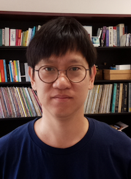
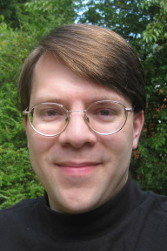
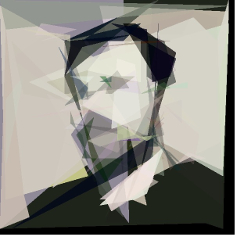
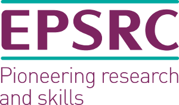

[CFP](#call-for-papers)
[Organisers](#organisers)
[PC](#pc)
[Sponsors](#sponsors) 

## **The 8th International Workshop on Genetic Improvement @[ICSE 2020](https://conf.researchr.org/home/icse-2020)**

{: style="text-align:center"}

The 8th Workshop on Genetic Improvement was held at the International Conference on Software Engineering ([ICSE](https://conf.researchr.org/home/icse-2020)), 2020, Seul, South Korea, in **May 2020**. 

## Call For Papers

We invite submissions that discuss recent developments in all areas of research on, and applications of, Genetic Improvement.
GI is the premier workshop in the field and provides an opportunity for researchers interested in automated program repair and software optimisation to disseminate their work, exchange ideas and discover new research directions.
Topics of interest include both the theory and practice of Genetic Improvement. Applications include, but are not limited to, using GI to:

• improve efficiency

• decrease memory consumption

• decrease energy consumption

• transplant new functionality

• specialise software

• translate between programming languages

• generate multiple versions of software

• repair bugs

We invite submissions of two paper types:

• Research papers (limit 8 pages)

• Position papers (limit 2 pages)

We encourage authors to submit early and in-progress work. The workshop emphasises interaction and discussion.
All papers should be submitted via EasyChair:
https://easychair.org/conferences/?conf=giicse2020
double-blind as pdfs (in the ACM conference format as per the ICSE 2020 information). 
All accepted papers must be presented at GI 2020 and will appear in the ICSE workshops volume. The official publication date of the workshop proceedings is the date the proceedings are made available online.

## Organisers

[Shin Yoo](https://coinse.kaist.ac.kr/members/shin.yoo/) is a tenure-track Associate Professor at Korea Advanced Institute of Science and Technology in Daejeon, Republic of Korea. His main re- search interests are fault localisation, search based software testing, and genetic improvement. 

 
 
 

[Justyna Petke](http://www0.cs.ucl.ac.uk/staff/j.petke) is a Principal Research Fellow and Proleptic Senior Lecturer (Associate Professor) in the Centre for Research on Evolution, Search and Testing (CREST), at University College London. She is interested in Genetic Improvement, Search-Based Software Engineering, and Constraint Satisfaction. She holds an EPSRC Fellowship on Genetic Improvement.

 
 
 

[Westley Weimer](https://web.eecs.umich.edu/~weimerw) is a Professor at the University of Michigan. He is interested in program analysis and transformation, automated program repair, and improvement of software properties.

 
 
 

[Bobby R. Bruce](https://www.bobbybruce.net) is a Postdoctoral Scholar at UC Davis where he primarily works on the Gem5 computer architecture simulator. Prior to UC Davis, Bobby carried out research into the automatic optimization of Java bytecode at UCLA. 

 
 
 

Web Chair: [Gabin An](https://coinse.kaist.ac.kr/members/gabin/) is an MSc candidate at School of Computing Korea Advanced Institute of Science and Technology, Republic of Korea.

## PC

TBD

## Sponsors

**Please get in touch with one of the organisers if you'd like to sponsor our workshop.**

We are grateful to our sponsors for their support of the 8th International Workshop (GI@ICSE 2020).

