[CFP](#call-for-submissions)
[Organisers](#organisers)
[PC](#pc)
[Sponsors](#sponsors) 

## **The 8th International Workshop on Genetic Improvement @[ICSE 2020](https://conf.researchr.org/home/icse-2020)**

{: style="text-align:center"}

## Important Dates

- **Submission Deadline**: <strike>22 January 2020 (Wed)</strike> 31 January 2020
- **Notification**: 25 February 2020 (Tue)
- **Camera-ready**: 16 March 2020 (Mon)
- **Workshop**: TBD

## Call For Submissions [[pdf](https://github.com/geneticimprovementofsoftware/geneticimprovementofsoftware.github.io/raw/master/cfp.pdf)]

We invite submissions that discuss recent developments in all areas of research on, and applications of, Genetic Improvement. 
GI is the premier workshop in the field and provides an opportunity for researchers interested in automated program repair and software optimisation to disseminate their work, exchange ideas and discover new research directions.
Topics of interest include both the theory and practice of Genetic Improvement. Applications include, but are not limited to, using GI to:

•	improve efficiency

•	decrease memory consumption

•	decrease energy consumption

•	transplant new functionality

•	specialise software

•	translate between programming languages

•	generate multiple versions of software

•	repair bugs

## Research & Position Papers
We invite submissions of two paper types:

•	Research papers (limit 8 pages)

•	Position papers (limit 2 pages)

We encourage authors to submit early and in-progress work. The workshop emphasises interaction and discussion.
All papers should be submitted via HotCRP:
<https://icse20-gi8.hotcrp.com/>
double-blind as pdfs (in the [ACM conference format](https://www.acm.org/publications/proceedings-template) as per the [ICSE 2020 information](https://conf.researchr.org/track/icse-2020/icse-2020-papers#Call-for-Papers)) [[download LaTeX template](https://www.acm.org/binaries/content/assets/publications/consolidated-tex-template/acmart-master.zip)].
> LaTeX users must use the provided `acmart.cls` and `ACM-Reference-Format.bst` *without modification*, enable the conference format in the preamble of the document (i.e., `\documentclass[sigconf,review]{acmart}`), and use the ACM reference format for the bibliography (i.e., `\bibliographystyle{ACM-Reference-Format}`). The review option adds line numbers, thereby allowing referees to refer to specific lines in their comments.

All accepted papers must be presented at GI 2020 and will appear in the ICSE workshops volume. The official publication date of the workshop proceedings is the date the proceedings are made available online.

## Keynote

We are happy to announce that Mark Harman (Facebook, University College London) will give the keynote talk.

## Studentships

There will be up to five travel scholarships available for students whose work is accepted at the workshop.

## Organisers

[Shin Yoo](https://coinse.kaist.ac.kr/members/shin.yoo/) is a tenure-track Associate Professor at Korea Advanced Institute of Science and Technology in Daejeon, Republic of Korea. His main research interests are fault localisation, search based software testing, and genetic improvement. 

 
 
 

[Justyna Petke](http://www0.cs.ucl.ac.uk/staff/j.petke) is a Principal Research Fellow and Proleptic Senior Lecturer (Associate Professor) in the Centre for Research on Evolution, Search and Testing (CREST), at University College London. She is interested in Genetic Improvement, Search-Based Software Engineering, and Constraint Satisfaction. She holds an EPSRC Fellowship on Genetic Improvement.

 
 
 

[Westley Weimer](https://web.eecs.umich.edu/~weimerw) is a Professor at the University of Michigan. He is interested in program analysis and transformation, automated program repair, and improvement of software properties.

 
 
 

[Bobby R. Bruce](https://www.bobbybruce.net) is a Postdoctoral Scholar at UC Davis where he primarily works on the gem5 computer architecture simulator. Prior to UC Davis, Bobby carried out research into the automatic optimization of Java bytecode at UCLA. 

 
 
 

Web Chair: [Gabin An](https://coinse.kaist.ac.kr/members/gabin/) is an MSc candidate at School of Computing Korea Advanced Institute of Science and Technology, Republic of Korea.

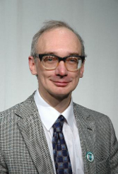
Special thanks to [Bill Langdon](http://www0.cs.ucl.ac.uk/staff/W.Langdon/) for helping with advertising the workshop.

 
 
 

## PC

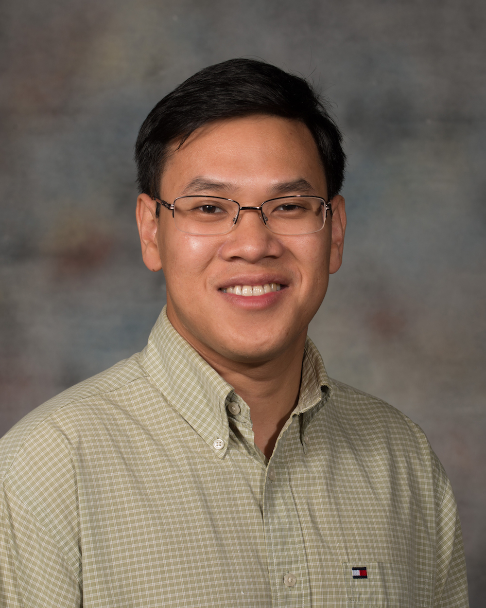

- [ThanhVu Nguyen](https://cse.unl.edu/~tnguyen/)

- [Aymeric Blot](http://www0.cs.ucl.ac.uk/staff/a.blot/)

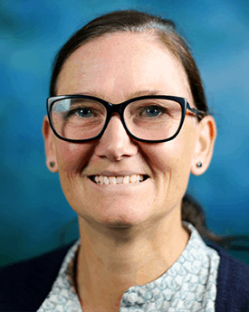

- [Tracy Hall](https://www.lancaster.ac.uk/scc/about-us/people/tracy-hall)

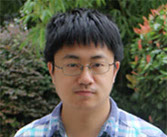

- [Jifeng Xuan](http://jifeng-xuan.com/)

- [Yuan Yuan](https://yyxhdy.github.io/)

- [Colin Johnson](http://www.cs.kent.ac.uk/people/staff/cgj)

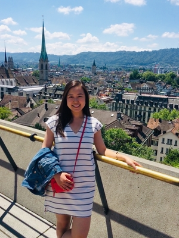

- [Yu Huang](http://www-personal.umich.edu/~yhhy/)

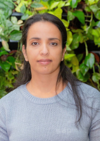

- [Nadia Alshahwan](https://www.linkedin.com/in/nadiaalshahwan)

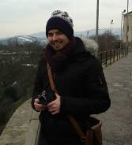

- [Christopher Timperley](https://www.cs.cmu.edu/directory/ctimperl)

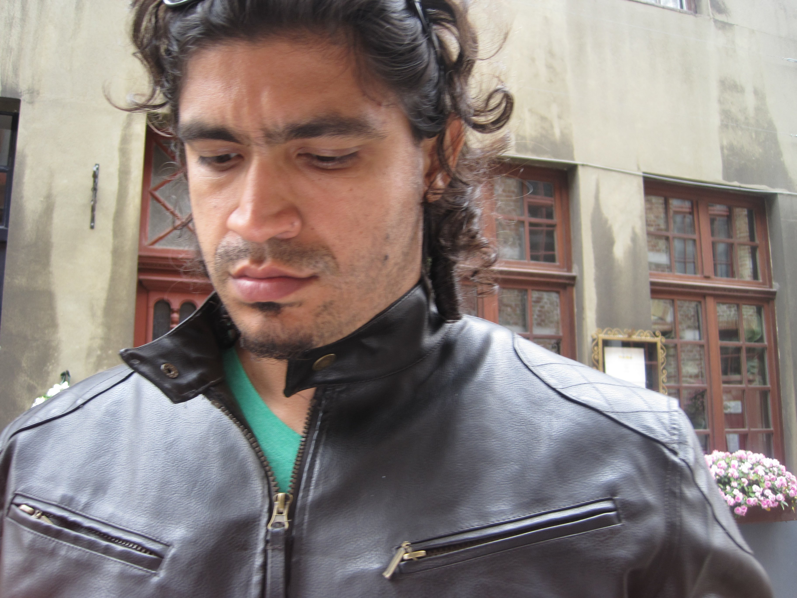

- [Leonardo Trujillo](https://sites.google.com/site/leonardotrujillogp/)

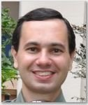

- [Márcio Barros](http://www.uniriotec.br/~marcio.barros/)

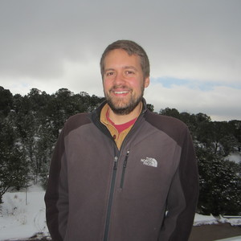

- [Eric Schulte](https://www.cs.unm.edu/~eschulte/)

- [Lea Kristin Gerling](https://sse.uni-hildesheim.de/mitglieder/lea-kristin-gerling)

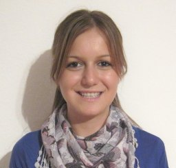

- [Marija Selakovic](http://marija.skyresource.com)

- [Bach Le](https://cis.unimelb.edu.au/people/bach-le)

## Sponsors

**Please get in touch with one of the organisers if you'd like to sponsor our workshop.**

We are grateful to our sponsors for their support of the 8th International Workshop (GI@ICSE 2020).

