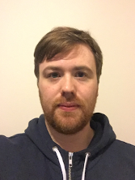

# The 6th International Workshop on Genetic Improvement Organising Committee 

 

## Justyna Petke

[Justyna Petke](http://www0.cs.ucl.ac.uk/staff/j.petke) is a Principal Research Fellow and Proleptic Senior Lecturer in the Centre for Research on Evolution, Search and Testing (CREST), at University College London. She is interested in Constraint Satisfaction, Search-Based Software Engineering, and Genetic Improvement.

## Shin Hwei Tan 陈馨慧

[Shin Hwei Tan](https://www.shinhwei.com) is a tenure-track Assistant Professor at the Southern University of Science and Technology. Her research interests include automated program repair, software testing, comment analysis, test repair, and mobile app analysis.

## William B. Langdon

[William B. Langdon](http://www0.cs.ucl.ac.uk/staff/w.langdon) is a Professorial research associate at University College London. His research interests include genetic programming and genetic improvement.

## Westley Weimer

[Westley Weimer](https://web.eecs.umich.edu/~weimerw) is a Professor at the University of Michigan. He is interested in program analysis and transformation, automated program repair, and improvement of software properties.

## Bobby R. Bruce

[Bobby R. Bruce](https://web.cs.ucla.edu/~b.bruce) is a Postdoctoral Scholar at the University of California, Los Angeles. His research interests include genetic improvement, and search-based software engineering. He maintains the [geneticimprovementofsoftware.com](http://www.geneticimprovementofsoftware.com) web-page.

# The 6th International Workshop on Genetic Improvement Program Committee

 

## Nadia Alshahwan

[Nadia Alshahwan](https://www.linkedin.com/in/nadiaalshahwan) is a Software Engineer at Facebook, London.

## Brad Alexander

[Brad Alexander](http://www.cs.adelaide.edu.au/~brad/) is a Lecturer at the University of Adelaide.

## Aniko Ekart

[Aniko Ekart](https://www2.aston.ac.uk/eas/staff/a-z/dr-aniko-ekart) is the Associate Dean of Postgraduate Programmes at Aston University.

## Saemundur Haraldsson

[Saemundur Haraldson](https://www.lancaster.ac.uk/sci-tech/about-us/people/saemundur-haraldsson) is a Senior Research Associate at Lancaster University.

## Ciera Jaspan

[Ciera Jaspan](https://research.google.com/pubs/CieraJaspan.html) is the tech lead manager of the Engineering Productivity Research within Developer Infrastructure at Google.

## Colin Johnson

[Colin Johnson](http://www.cs.kent.ac.uk/people/staff/cgj) is a Reader and Associate Dean of Sciences at the University of Kent.

## Lea Kristin Gerling

[Lea Kristin Gerling](https://sse.uni-hildesheim.de/mitglieder/lea-kristin-gerling) works for the Software Engineering Systems group at Hildesheim University.

## Corina Pasareanu

[Corina Pasareanu](https://ti.arc.nasa.gov/profile/pcorina/) is a software engineering researcher at the NASA Ames Research Center.

## Abhik Roychoudhury

[Abhik Roychoudhury](http://www.comp.nus.edu.sg/~abhik/) is a Professor in the School of Computing at the National University of Singapore.

## Christopher Timperley

[Christopher Timperley](https://www.cs.cmu.edu/directory/ctimperl) is a Systems Scientist at Carnegie Mellon University.

## Emamurho Ugherughe

[Emamurho Ugherughe](https://www.linkedin.com/in/emamurho) is a Software Engineer at SAP, Berlin.

## Markus Wagner

[Markus Wagner](http://cs.adelaide.edu.au/~markus/) is a Senior Lecturer at the University of Adelaide.

## David R. White

[David R. White](http://www.davidrwhite.co.uk/) is a Research Associate at the University of Sheffield.

## John Woodward

[John Woodward](http://www.eecs.qmul.ac.uk/people/view/54720/dr-john-woodward) is a Lecturer at Queen Mary University.

## Jifeng Xuan

[Jifeng Xuan](http://jifeng-xuan.com/) is a Professor at Wuhan University.

## Bing Xue

[Bing Xue](http://ecs.victoria.ac.nz/Main/BingXue) is a Senior Lecturer at the University of Wellington.

## Ling Zhu

[Ling Zhu](https://linkedin.com/in/ling-zhu-a8098b15) is a Research Engineer at the Ford Motor Company.

## Nur Zincir-Heywood

[Nur Zincir-Heywood](http://www.cs.dal.ca/~zincir) is a Professor at Dalhousie University.
